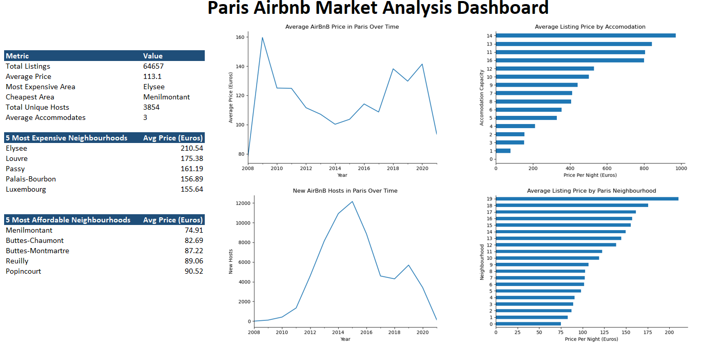

# 🏠 Automated Airbnb Market Analytics Dashboard

## 📌 Project Overview

This project analyzes Airbnb market trends in Paris using Python and generates an automated Excel dashboard for reporting and visualization. The workflow includes data cleaning, transformation, exploratory data analysis, chart generation, and automated dashboard creation.

The analysis was conducted using the `listings.csv` dataset from a larger Airbnb dataset containing over **250K listings** across multiple cities.

---

## 🎯 Objectives

* Clean and prepare Airbnb listings data for analysis
* Explore pricing and host activity trends in Paris
* Generate business insights through visualization
* Automate dashboard creation and reporting using Python

---

## 📊 Dataset

**Dataset:** [Airbnb Listings & Reviews – Maven Analytics](https://mavenanalytics.io/data-playground/airbnb-listings-reviews)

### Files Used

* `listings.csv`

### Scope

* Filtered to Paris listings only

### Selected Fields

* `host_since`
* `neighbourhood`
* `city`
* `accommodates`
* `price`

---

## 🛠️ Tools & Technologies

* Python
* Pandas
* Seaborn
* Matplotlib
* openpyxl
* Excel

---

## ⚙️ Workflow

```text
Listings.csv
      ↓
Data Cleaning & Validation
      ↓
Data Transformation & Aggregation
      ↓
Exploratory Data Analysis
      ↓
Visualization
      ↓
Automated Excel Dashboard Generation
```

---

## 📈 Dashboard Features

* KPI summary cards
* Average Airbnb price trends over time
* New host growth analysis
* Price comparison by accommodation size
* Neighborhood-level price analysis
* Top affordable and expensive neighborhoods

---

## 🖼️ Dashboard Preview



---

## 🔍 Key Insights

* The nearly **3× price difference** between Élysée (€210.54) and Ménilmontant (€74.91) suggests that location has a stronger influence on pricing than accommodation size alone.
* Rapid growth in new hosts between **2011–2015** coincided with a decline in average prices, indicating that increased supply likely intensified competition among hosts.
* Airbnb host growth peaked around **2015**, indicating rapid market expansion followed by market saturation.
* Larger accommodations generally command higher prices, showing a positive relationship between capacity and revenue potential.
* The sharp decline in both new hosts and average prices after **2019** highlights the Airbnb market's dependence on tourism demand and its vulnerability to external disruptions such as **COVID-19**.

---

## 🤖 Automation Highlights

Python automation was used throughout the project to streamline the reporting workflow. Instead of manually cleaning data, calculating metrics, creating charts, and designing the dashboard, these tasks were automated into a repeatable process.

---
