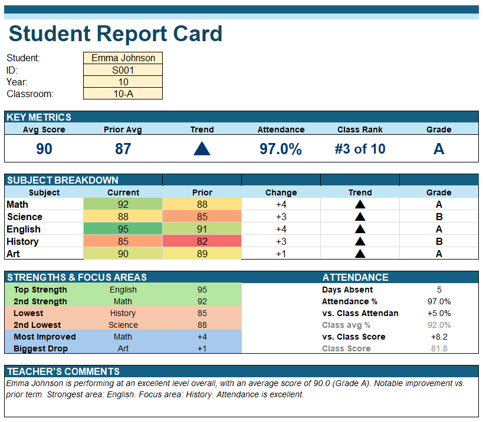

# 📑 Student Performance Report Automation in Excel

An automated **Student Performance Report** built in Microsoft Excel that generates a comprehensive report card from a structured dataset using advanced Excel formulas and features. The report dynamically retrieves student information, calculates performance metrics, compares current and previous scores, ranks students, identifies strengths and focus areas, and generates summary comments without using VBA or macros.

This project demonstrates practical Excel skills used in business reporting and data analysis, including lookup functions, logical formulas, ranking, conditional formatting, and automated report generation.

---

## 📸 Preview

### Student Report

  

---

## ✨ Features

- Dynamic report updates using Data Validation dropdown selection
- Automatic student information retrieval
- Subject-wise performance analysis
- Current vs. previous score comparison
- Grade assignment
- Class ranking
- Attendance analysis
- Automatic identification of strengths and focus areas
- Formula-generated teacher comments
- Color-coded performance indicators using Conditional Formatting

---

## 🛠 Excel Skills Demonstrated

### Advanced Excel Formulas & Features

- **XLOOKUP()** – Retrieve student information and subject scores from the master dataset
- **Nested IF()** – Assign grades, determine trends, classify performance, and generate teacher comments
- **RANK.EQ()** – Calculate class rankings
- **TRANSPOSE()** – Rearrange data dynamically for report layout
- **AVERAGE()**, **MAX()**, **MIN()**, **AND()**, **OR()** – Perform score calculations and logical analysis
- **Data Validation** – Create dynamic dropdowns for report selection and controlled user input
- **Conditional Formatting** – Highlight performance trends and key metrics visually

### Reporting Techniques

- Automated report generation
- Dynamic KPI reporting
- Lookup-based data retrieval
- Comparative performance analysis
- Formula-driven report automation
- Interactive report selection using Data Validation
- Conditional Formatting for visual insights
- Structured report design

---

## 📊 Report Sections

- Student Information
- Key Performance Metrics
- Subject-wise Performance Breakdown
- Strengths & Focus Areas
- Attendance Summary
- Teacher's Comments

---

## 🎯 Learning Outcomes

This project helped strengthen my ability to:

- Build automated reports using Microsoft Excel
- Apply advanced lookup and logical formulas
- Design structured business reports
- Use Conditional Formatting to highlight key insights
- Automate repetitive reporting tasks without VBA
- Transform raw data into meaningful, decision-ready reports

---

## 🧰 Tools Used

- Microsoft Excel
- Advanced Excel Formulas
- Data Validation
- Conditional Formatting

---

## 🚀 Future Improvements

- Add PivotTables for summary reporting
- Include interactive charts to visualize performance trends
- Enhance automation with Power Query or Power Pivot
